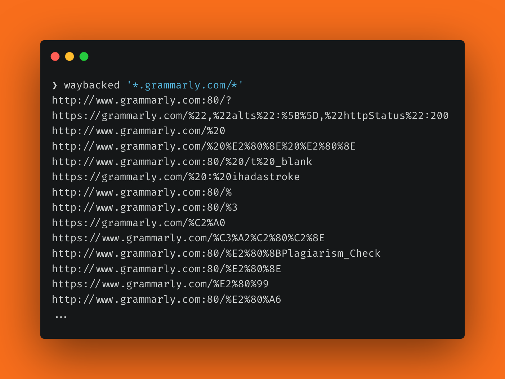

# waybacked

Get URLs from the Wayback Machine. `waybacked` is well-suited for bug bounty or security reconnaissance since it is able to handle large outputs.



## How to install

```
$ git clone https://github.com/KarimPwnz/waybacked.git
$ cd waybacked
$ python3 setup.py install
```

## Usage

```
$ waybacked <search_query>
```

